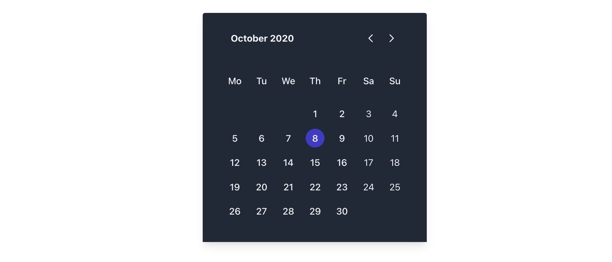

# react-tailwind-datepick #



## Installation
```
npm install react-tailwind-datepick
```

```javascript
import { RtwDatepick } from "react-tailwind-datepick"

function App() {
  const [ month, monthSet ] = useState(5);
  const [ year, ] = useState(2022);
  const [ date, ] = useState(10);
  
  return (
    <div className="App">
      <header className="App-header">
        <header className="App-header">
          <RtwDatepick
            year={year}
            month={month}
            date={date}
            onMonthChange={monthSet}
          />
      </header>
    </div>
  );
}

export default App;
```

## Contribute Installation ##
```
git clone https://github.com/andreaharris-go/react-tailwind-datepick.git

cd react-tailwind-datepick

npm install

npm run build-watch

cd examples/main

npm install

npm run start
```

Dev URL. http://localhost:3000
